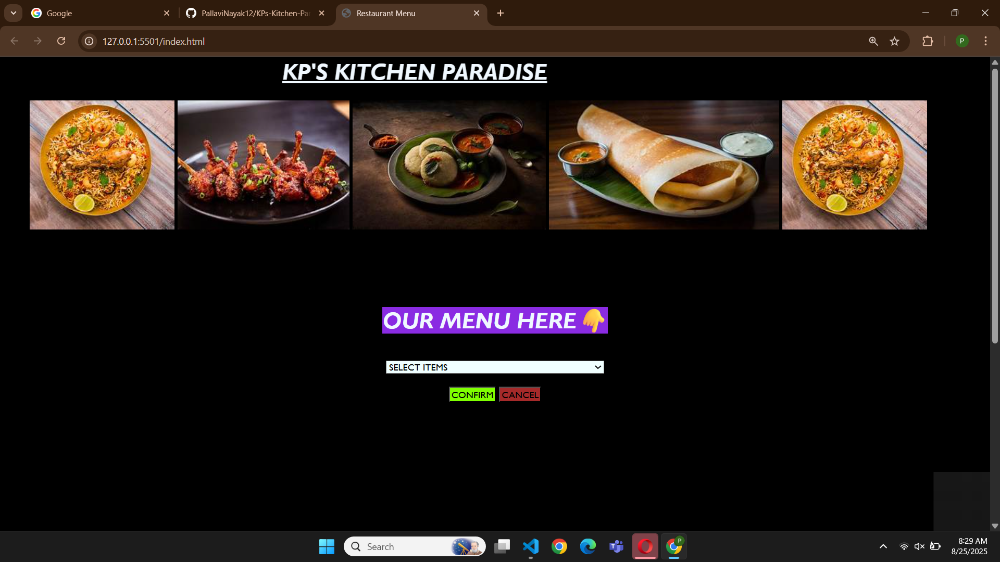
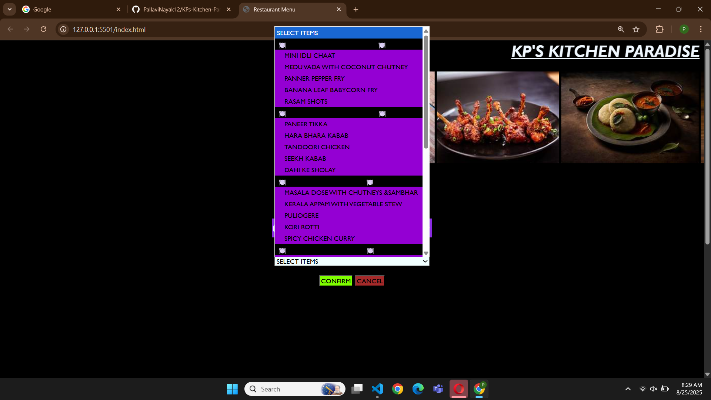

# 🍴 KP’s Kitchen Paradise  

A **static restaurant menu webpage** built using **HTML and CSS**.  
This project displays a stylish restaurant menu with food images and dropdown selection for dishes.  

---

## 📌 Features  
- 🎨 Beautiful and simple UI using **only HTML & CSS**  
- 🖼️ High-quality food images included  
- 📂 Organized menu with sections  
- ✅ Confirm & Cancel buttons styled with CSS  

---

## 🚀 Tech Stack  
- **HTML5** – Page structure  
- **CSS3** – Styling & layout  

---

## 📷 Screenshots  

### 🏠 Homepage  
  

### 📑 Menu Dropdown  
  

---

## ⚡ How to Run  
1. Clone this repository:  
   ```bash
   git clone https://github.com/PallaviNayak12/KPs-Kitchen-Paradise.git
